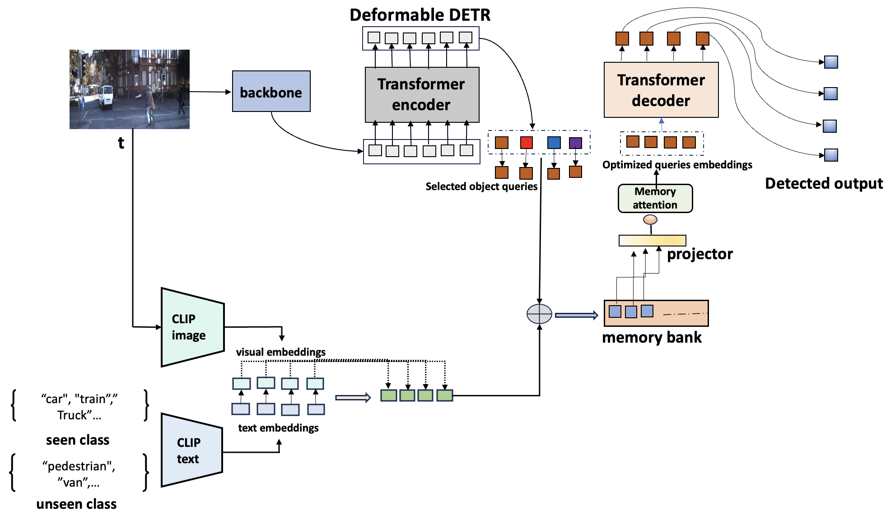

<h1 align="center"> DET-LIP </h1>

<h2 align="center">

</h2>

This repository contains the implementation of the following paper:
> **DET-LIP**<br>

  
<p align="center">
  
</p>

## Installation

We use the same environment as [Deformable DETR](https://github.com/fundamentalvision/Deformable-DETR).
You are also required to install the following packages:

- [CLIP](https://github.com/openai/CLIP)
- [cocoapi](https://github.com/cocodataset/cocoapi)


We test our models under ```python=3.8, pytorch=1.11.0, cuda=10.1```, 8 Nvidia V100 32GB GPUs.

## Data
Please refer to [dataset_prepare.md](./dataset_prepare.md).


## Model Zoo
- Open-vocabulary COCO (AP50 metric)

| Base | Novel| All | Model |
|------|------|-----|-------|
| 61.0 | 29.4 | 52.7|[Google Drive](https://drive.google.com/file/d/1_iypFgVsLQwXVrT5zDtKeFaxOcC_A3uO/view?usp=sharing)|

## Citation
If you find our work useful for your research, please consider citing the paper:


## License
<a rel="license" href="http://creativecommons.org/licenses/by-nc-sa/4.0/"></a><br />This work is licensed under a <a rel="license" href="http://creativecommons.org/licenses/by-nc-sa/4.0/">Creative Commons Attribution-NonCommercial-ShareAlike 4.0 International License</a>.

## Acknowledgement
We would like to thanks [Deformable DETR](https://github.com/fundamentalvision/Deformable-DETR), [CLIP](https://github.com/openai/CLIP) and [ViLD](https://github.com/tensorflow/tpu/tree/master/models/official/detection/projects/vild) for their open-source projects.

